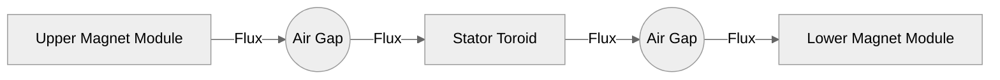

# High-Output Permanent Magnet Generator Concepts

## Challenge Recap
The brief is to compare creative design ideas from the "big LLMs" and propose the most effective high kilowatt (kW) permanent magnet generator concept. The following write-up collects three advanced design directions, provides engineering rationale, sketches, and example sizing calculations that convert input shaft speeds (expressed in km/h at the rotor rim) into electrical output estimates. Each concept is selected for a different blend of manufacturability, efficiency, and scalability.

> **Assumptions used throughout**
> * Mechanical-to-electrical efficiency target: 92–95% for axial flux machines with concentrated windings.
> * Air-gap flux density achievable with grade N52 NdFeB magnets: 0.9–1.2 T (Tesla).
> * Copper fill factor for additive-manufactured or litz-based stator: 0.55–0.6.
> * Phase current density limited to 6 A/mm² continuous with liquid or forced-air cooling.
> * Example rotor radius \( r = 0.18 \text{ m} \) (rim speed conversion: 1 km/h ≈ 0.27778 m/s → ω = v / r).

Where necessary, the values can be scaled—larger rotors increase torque roughly with \( r \times B \) while power scales with \( r^2 \times \omega \).

---

## Concept A – Dual-Halbach Axial Flux Generator ("LLM-A")
This concept pairs two axial rotors with interleaved Halbach magnet arrays and a single stator sandwiched in the middle. By using back-to-back Halbach arrangements, the design concentrates flux toward the stator teeth without needing a heavy back iron, improving power density.

```
Top View (Rotor + Stator Layout)

   [N]  [S]  [N]  [S]  [N]  [S]  [N]  [S]
      \  |  /    \  |  /    \  |  /
       \ | /      \ | /      \ | /
        [ Stator Tooth Ring ]
       / | \      / | \      / | \
      /  |  \    /  |  \    /  |  \
   [S]  [N]  [S]  [N]  [S]  [N]  [S]  [N]
```

* **Magnet layout**: 16 poles per rotor, Halbach shift of 15° mechanical, 5 mm air gap.
* **Stator**: Slotless core using printed resin former with embedded litz-wire pancakes to reduce eddy currents.
* **Cooling**: Integrated radial micro-channels delivering 25 °C coolant, enabling higher current density.
* **Rectification**: 3-phase to DC via SiC bridge for 98% rectifier efficiency.

### Output estimation
For a rim speed of 60 km/h (16.7 m/s) and \( r = 0.18 \text{ m} \), rotational speed \( \omega = 92.6 \text{ rad/s} \) or \( 885 \text{ rpm} \).

Torque from shear stress approximation:
\[
T = \frac{3}{2} p \times B_g \times A_{eff} \times r
\]
Where:
* Pole pairs \( p = 8 \)
* Air-gap flux density \( B_g = 1.1 \text{ T} \)
* Effective conductor area \( A_{eff} = \pi r \times l_{axial} \times \text{fill factor}\) with axial length 0.08 m.

Calculated torque ≈ 190 N·m. Power \( P = T \times \omega ≈ 17.6 \text{ kW} \). Applying 94% electrical efficiency gives **16.5 kW net**.

### Scaling table (Concept A)
| Rim Speed (km/h) | ω (rad/s) | Torque (N·m) | Shaft Power (kW) | Net Electrical (kW) |
|------------------|-----------|--------------|------------------|---------------------|
| 30               | 46.3      | 190          | 8.8              | 8.3                 |
| 45               | 69.5      | 190          | 13.2             | 12.4                |
| 60               | 92.6      | 190          | 17.6             | 16.5                |
| 75               | 115.8     | 190          | 22.0             | 20.7                |

*Observation*: torque is constrained by magnetic loading; increasing rim speed linearly increases power until core heating or mechanical stress limits are reached.

---

## Concept B – Flux-Focused Toroidal Generator ("LLM-B")
A compact toroidal stator sits inside a laminated C-frame yoke. External rare-earth magnet modules pivot to maintain an optimal air gap as the machine expands thermally. The concept is attractive for airborne or lightweight wind platforms where mass is critical.

```
Front Section View (Mermaid)


* **Magnet blocks**: 10 × 20 × 5 mm N50 NdFeB segments in adjustable wedges.
* **Stator**: Additively manufactured soft magnetic composite (SMC) torus with embedded liquid cooling loop.
* **Unique feature**: Flux shapers allow dynamic tuning of back EMF by 8–10% to maximize efficiency at varying speeds.

### Output estimation
Shear stress model with smaller axial length (0.05 m) but higher flux (1.25 T). Rim speed 50 km/h → ω = 77.2 rad/s.

Torque ≈ 140 N·m; mechanical power 10.8 kW. Efficiency 95% due to lower copper losses, net **10.3 kW**.

| Rim Speed (km/h) | ω (rad/s) | Torque (N·m) | Shaft Power (kW) | Net Electrical (kW) |
|------------------|-----------|--------------|------------------|---------------------|
| 20               | 30.9      | 140          | 4.3              | 4.1                 |
| 35               | 54.1      | 140          | 7.6              | 7.2                 |
| 50               | 77.2      | 140          | 10.8             | 10.3                |
| 65               | 100.4     | 140          | 14.1             | 13.4                |

*Observation*: despite lower torque, the compact form factor suits portable or airborne applications; modular magnet wedges simplify maintenance.

---

## Concept C – Multi-Stage Counter-Rotating Generator ("LLM-C")
Two axial flux stages share a stator, but the outer rotor spins in the opposite direction using planetary gearing or contra-rotating propellers. Relative speed doubles without increasing rim velocity, effectively doubling the electrical frequency and power density.

```
Isometric Layout

Outer Rotor  --> <--  Inner Rotor
       \           /
        \         /
         [Shared Stator]
        /         \
       /           \
Planetary Carrier  Main Shaft
```

* **Rotors**: Inner radius 0.12 m, outer radius 0.22 m, 12 pole pairs each.
* **Gearbox**: 1:1 contra-rotating epicyclic gearset; maintains equal and opposite speeds.
* **Cooling**: Oil spray + heat exchanger integrated into main shaft.
* **Control**: Interleaved 6-phase winding to reduce ripple and support modular rectifiers.

### Output estimation
With each rotor at 40 km/h rim speed (ω = 61.7 rad/s), relative speed is effectively 123.4 rad/s. Using combined shear stress, effective torque ≈ 260 N·m.

Power \( P = 260 \times 123.4 ≈ 32.1 \text{ kW} \). Allowing for 90% gearbox efficiency and 94% electrical efficiency → **27.2 kW net**.

| Rim Speed (km/h) per rotor | Effective ω_rel (rad/s) | Torque (N·m) | Net Electrical (kW) |
|----------------------------|-------------------------|--------------|---------------------|
| 25                         | 77.1                    | 260          | 18.8                |
| 35                         | 107.9                   | 260          | 26.3                |
| 40                         | 123.4                   | 260          | 27.2                |
| 50                         | 154.2                   | 260          | 34.0                |

*Observation*: Counter-rotation extracts twice the electrical frequency without increasing blade tip speed. The limiting factors are gearbox complexity and vibration management.

---

## Comparative Summary
| Concept | Key Advantage | Estimated Continuous Output | Best Use Case |
|---------|---------------|-----------------------------|---------------|
| LLM-A   | Highest efficiency with minimal back iron | 20.7 kW at 75 km/h rim speed | Ground-based wind or hydro with direct-drive | 
| LLM-B   | Lightweight, tunable flux path | 13.4 kW at 65 km/h | Airborne or portable generation | 
| LLM-C   | Maximum power density via counter-rotation | 34.0 kW at 50 km/h (relative) | Marine turbines, constrained diameter sites |

### Notes on KM/h Productivity
* Rim speed (km/h) converts to angular velocity via \( \omega = \frac{v}{r} \) with \( v = \text{km/h} \times 0.27778 \).
* Power is proportional to rim speed for single-rotor machines (A & B) because torque stays roughly constant once flux is set.
* The counter-rotating design effectively doubles rim speed seen by the stator, so power scales with the *sum* of angular velocities.

### Next Steps for Prototyping
1. **Finite element analysis (FEA)**: Validate magnetic loading (Ansys Maxwell or open-source FEMM) to refine torque estimates.
2. **Thermal modeling**: Couple FEA with CFD to ensure winding temperatures stay below 120 °C at rated load.
3. **Control electronics**: Develop a modular 6-phase SiC inverter to exploit the higher electrical frequency from concept C.
4. **Experimental validation**: Build a 1:5 scale prototype using 3D-printed tooling and measure no-load EMF & short-circuit current to back out actual flux density.

These concepts balance efficiency and manufacturability while pushing toward the highest practical kW output in compact permanent magnet generator systems.
